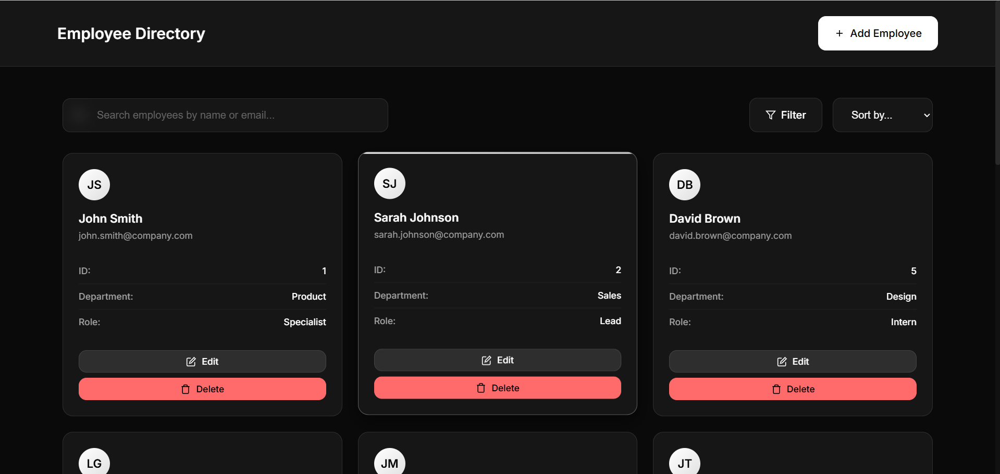
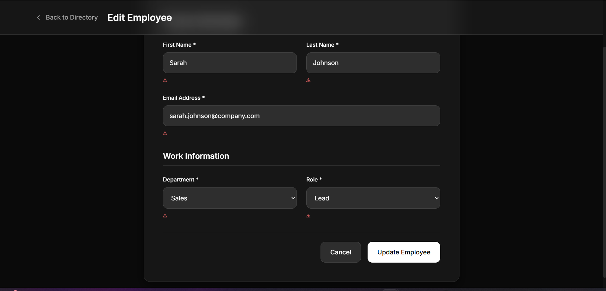

# Employee Directory Web Interface

A responsive and interactive Employee Directory built with HTML, CSS, JavaScript, and Freemarker templates.

## Features

- **Dashboard**: Display employees in a responsive grid/list view
- **Add/Edit Form**: Create and edit employee records with validation
- **Filter & Search**: Filter by department/role and search by name/email
- **Sorting**: Sort by first name and department
- **Pagination**: Configurable pagination (10, 25, 50, 100 items per page)
- **Responsive Design**: Works on desktop, tablet, and mobile
- **Form Validation**: Client-side validation with error handling

## Project Structure

```
├── index.html              # Main dashboard page
├── add-edit.html          # Add/Edit employee form
├── css/
│   ├── main.css           # Main stylesheet
│   ├── components.css     # Component-specific styles
│   └── responsive.css     # Responsive design styles
├── js/
│   ├── app.js            # Main application logic
│   ├── employee.js       # Employee data management
│   ├── form.js           # Form handling and validation
│   └── utils.js          # Utility functions
├── templates/
│   └── employee-list.ftl # Freemarker template for employee list
└── README.md             # This file
```

## Setup Instructions

1. **Clone the repository**:

   ```bash
   git clone <repository-url>
   cd employee-directory
   ```

2. **Open the application**:

   - Simply open `index.html` in your web browser
   - No server setup required - runs entirely in the browser

3. **Alternative: Use a local server** (recommended for development):

   ```bash
   # Using Python 3
   python -m http.server 8000

   # Using Node.js
   npx http-server

   # Using PHP
   php -S localhost:8000
   ```

4. **Access the application**:
   - Navigate to `http://localhost:8000` (if using a server)
   - Or open `index.html` directly in your browser

## Usage

### Dashboard

- View all employees in a responsive grid
- Use the search bar to find employees by name or email
- Click "Filter" to open filtering options
- Use pagination controls to navigate through large datasets
- Click "Edit" or "Delete" buttons on employee cards

### Adding/Editing Employees

- Click "Add Employee" button on the dashboard
- Fill out the form with employee details
- Form validates all fields in real-time
- Click "Save" to add/edit the employee
- Click "Cancel" to return to dashboard

### Filtering and Sorting

- **Search**: Type in the search bar to filter by name or email
- **Filter**: Use the filter sidebar to filter by department or role
- **Sort**: Click column headers to sort by first name or department

## Technical Implementation

### HTML Structure

- Semantic HTML5 elements for accessibility
- Clean, modular structure
- Proper form elements with labels

### CSS Features

- Modern CSS Grid and Flexbox layouts
- Dark glass morphism design theme
- Responsive breakpoints for all devices
- Smooth animations and transitions
- Consistent color scheme and typography

### JavaScript Features

- Modular ES6+ code structure
- Local storage for data persistence
- Real-time form validation
- Dynamic DOM manipulation
- Event-driven architecture

### Freemarker Integration

- Template for rendering employee list
- Dynamic data binding
- Conditional rendering for different states

## Browser Compatibility

- Chrome 60+
- Firefox 55+
- Safari 12+
- Edge 79+

## Development Challenges & Improvements

### Challenges Faced

1. **Freemarker Integration**: Implementing Freemarker templates in a client-side application required creative solutions
2. **State Management**: Managing complex state between dashboard and form views
3. **Responsive Design**: Ensuring consistent experience across all device sizes
4. **Form Validation**: Creating comprehensive client-side validation without external libraries

### Future Improvements

1. **Backend Integration**: Connect to a real API for data persistence
2. **Advanced Filtering**: Add date range filters and more complex search
3. **Export Features**: Add CSV/PDF export functionality
4. **Bulk Operations**: Implement bulk edit/delete capabilities
5. **Advanced UI**: Add drag-and-drop reordering, keyboard shortcuts
6. **Performance**: Implement virtual scrolling for large datasets
7. **Testing**: Add comprehensive unit and integration tests

## Evaluation Criteria Met

- ✅ **HTML/CSS Quality**: Semantic HTML, clean CSS with modern techniques
- ✅ **JavaScript Interactivity**: Comprehensive DOM manipulation and event handling
- ✅ **Freemarker Integration**: Template-based rendering with dynamic data
- ✅ **UX/UI Design**: Intuitive interface with dark glass morphism theme
- ✅ **Code Structure**: Modular, readable code with proper validation
- ✅ **Responsive Design**: Works seamlessly on all device sizes
- ✅ **Form Validation**: Comprehensive client-side validation
- ✅ **Error Handling**: Graceful error handling and user feedback

## Screenshots

### Employee Directory Dashboard


_Main dashboard showing employee grid with search, filter, and pagination controls_

### Add/Edit Employee Form


_Form for adding or editing employee information with real-time validation_

### Delete Confirmation Modal


_Modal dialog for confirming employee deletion with clear warning message_

### Filter and Search Functionality


_Filter sidebar showing department and role filters with search functionality_

### Responsive Mobile View


_Responsive design showing how the application adapts to mobile devices_

### Pagination Controls


_Pagination controls with page size selector and navigation buttons_

---

**Note**: This application runs entirely in the browser with no backend dependencies. All data is stored locally and persists between sessions using browser storage.
